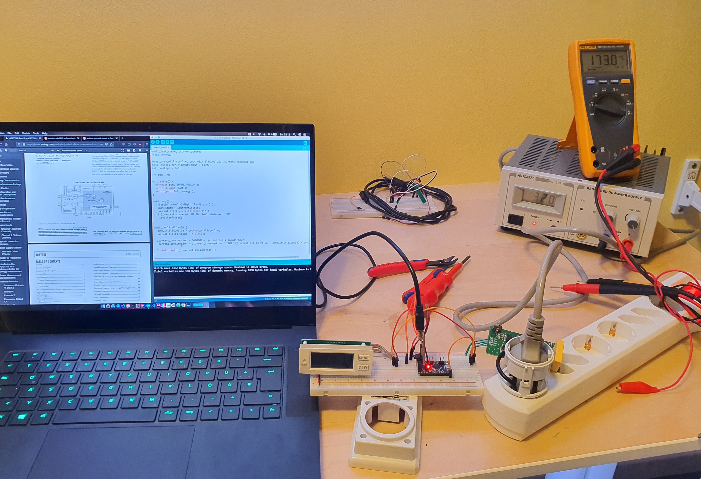
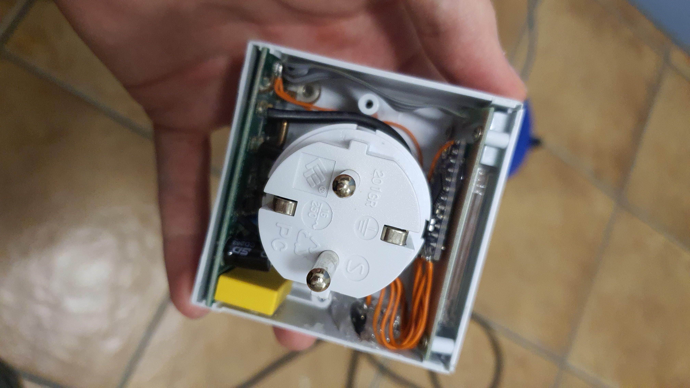
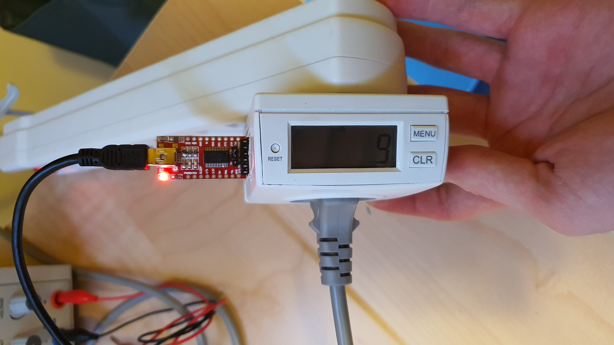

# WattMeter

## Warning
This project is on hold because I destroyed the wattmeter by not adhering to what I thought about in the first place (basically predicted this)... The power supply is NOT isolated from mains, plugging the USB of the FTDI into something that shorts USB GND to earth's terminal will turn this into a smoke-grenade. I ordered a new one and will then connect this over wifi, a socket extension is already being worked on.

## Introduction
Since I have got myself a home-server now, I'd like to monitor the power costs. I found an old watt-meter for plugging between appliances and the wall socket, which displays the number of watts drawn. I planted an arduino in there, that interfaces with the ADE7755 inside the store-bought circuit. A FTDI breakout board then converts those arduino serial signals into USB, which gets plugged into my server. Both the arduino firmware and the java service have been uploaded on this repo.

## Functionality
The arduino firmware is pretty self explanatory, you just need to remember to adjust the following parameters at the top: _pulses_per_kilowatt_hour, _voltage, _pin. The pulses/KWh is a value that you'll probably have to get through trial and error since it's almost impossible to read it out of the controller on bought boards. The voltage is something you should be knowing and the pin is the corresponding arduino pin that is connected to the ICs *pulse* pin.

The second part - the java service - is for monitoring the values provided by the arduino and making them persistent. It reads the usb data line by line and maps each watt value to the time it came in. Then, at every given interval the individual entries get averaged out and one entry gets written to database. You then can have a look at those values plotted on a frontend page.

## ToDo
* Create front end
* Bug-hunting??

## Images

